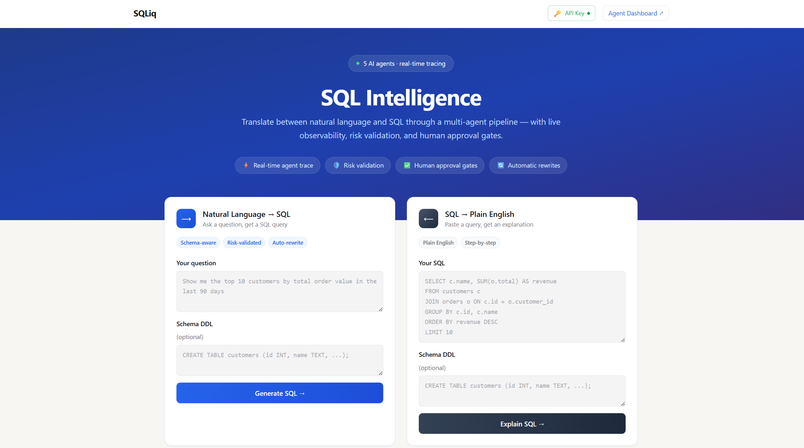

# SQLiq — SQL Intelligence

> **Prototype notice:** SQLiq is a demo application built to showcase [agentstatelib](https://github.com/tanveer-12/agentstate), a Python library for building observable, multi-agent AI systems. The goal is to show, end-to-end, what agentstatelib enables: real-time agent tracing, shared state across agents, human approval gates, conflict resolution, and a live dashboard - all in a production-shaped project.

Show some love to : [agentstatelib](https://github.com/tanveer-12/agentstate), I have been solo developing it, but would really love some constructive feedback on how to make it more robust !!

---

## LIVE URL (try it out): [sqliq-web-ui](https://sqliq.onrender.com/ui)

---
Web UI 



---
Youtube Demo Video
---
<!-- REPLACE THIS LINE WITH A GIF OF A FULL WORKFLOW (NL → SQL, trace panel, approval gate) -->
<div align="center">
  <a href="https://www.youtube.com/watch?v=9FNspFpIBdY">
    
    <br>
    <span style="font-size: 20px;">▶️ Watch on YouTube</span>
  </a>
</div>

---
## What it does

SQLiq translates between **natural language and SQL** in both directions:

| Mode | Input | Output |
|---|---|---|
| NL → SQL | *"Show me the top 10 customers by revenue in the last 90 days"* | A SQL query, risk-scored and optionally rewritten |
| SQL → Plain English | A SQL query | A plain-English explanation of what the query does |

Both modes run through a **multi-agent pipeline** with full live tracing. Every LLM call, token count, state patch, and approval decision is logged in real time and visible in both the terminal dashboard and the web UI.

---

## Agent pipeline

Each workflow runs through two phases separated by an optional human approval gate.

### Phase 1 — Analysis

```
[schema_parser] ──► [nl_to_sql] ──► [risk_validator] ──► [rewrite_agent]  (NL→SQL path)
                            │
                            └──► [explainer]

[schema_parser] ──► [explainer] ──► [risk_validator]                       (SQL→NL path)
```

| Agent | Role |
|---|---|
| **Schema Parser** | Parses raw DDL text into a structured schema dict. Runs first when a schema is provided. |
| **NL → SQL** | Translates the user's English question into a SQL query using the model and optional parsed schema. |
| **Explainer** | Produces a plain-English explanation of the SQL. Runs for both modes — explains the generated SQL in NL→SQL, explains the user's input SQL in SQL→NL. |
| **Risk Validator** | Scores the SQL for risk (0.0 – 1.0). Flags queries with `DELETE`, `DROP`, unbounded `UPDATE`, missing `WHERE` clauses, etc. |
| **Rewrite Agent** | If risk score > 0.7, proposes a safer rewrite and a reason. Only runs in NL→SQL mode. |

### Approval gate

When a high-risk query is detected and a rewrite is proposed, the workflow **pauses** before Phase 2. In the web UI you get a side-by-side diff of the original and proposed SQL and three choices. In the terminal you get the same via a Rich panel.

### Phase 2 — Finalization

```
[finalizer]
```

| Agent | Role |
|---|---|
| **Finalizer** | Assembles the final output — picks the approved/modified/original SQL, attaches the explanation, and marks the workflow complete. |

All agents share state through `agentstatelib`'s `SharedState` + `StatePatch` system. Every write is an immutable event appended to SQLite, which means the full workflow history is replayable and inspectable.

---

## Interfaces

### Web UI

```
npm run dev         # in frontend/
uvicorn app.api.server:create_app --factory  # in root
```

Open `http://localhost:5173` (dev, Vite proxy) or `http://localhost:8000/ui` (production build).

Features:
- Side-by-side NL→SQL and SQL→NL cards
- Live agent trace panel (SSE stream) — every event as it happens
- Approval gate UI with side-by-side SQL diff and accept/reject/modify
- Risk score badge on results
- Agent Dashboard link → full agentstatelib trace view

### Terminal (CLI)

```bash
python -m app.cli
```

The terminal shows the same workflow through Rich panels:

```
──────────────── SQLiq · SQL Intelligence ────────────────
  Powered by agentstatelib · Model: qwen2.5-coder:14b

  1  NL → SQL        Ask a question, get a SQL query
  2  SQL → English   Paste a query, get a plain-English explanation

  Select mode [1/2] (1):
```

When risk is high, the terminal pauses at the approval gate and shows a side-by-side syntax-highlighted diff before asking for your decision.

---

## Setup

### Prerequisites

- Python 3.11+
- Node 18+
- An OpenAI-compatible endpoint (Ollama locally, or Colab + ngrok — see below)

### Install

```bash
git clone https://github.com/tanveer-12/SQLiq
cd SQLiq
python -m venv .venv && source .venv/bin/activate   # Windows: .venv\Scripts\activate
pip install -e ".[dev]"
cd frontend && npm install && cd ..
```

### Configure

Copy `.env.example` to `.env` and fill in:

```env
# AI backend — Ollama locally:
SQLIQ_API_BASE=http://localhost:11434/v1
SQLIQ_API_KEY=ollama
SQLIQ_MODEL=qwen2.5-coder:14b

# Or Colab + ngrok (paste the ngrok HTTPS URL after starting the tunnel):
# SQLIQ_API_BASE=https://abc123.ngrok-free.app/v1

AGENTSTATE_API_KEYS=dev-key-123        # used to auth SSE stream + dashboard
VITE_AGENTSTATE_API_KEY=dev-key-123   # must match one key above
SQLIQ_DB_PATH=sqliq.db
SQLIQ_PORT=8000
```

### Run (dev)

```bash
# Terminal 1 — backend
uvicorn app.api.server:create_app --factory --reload --port 8000

# Terminal 2 — frontend dev server (hot reload)
cd frontend && npm run dev
```

Open `http://localhost:5173`.

### Run (production build)

```bash
cd frontend && npm run build && cd ..
uvicorn app.api.server:create_app --factory --host 0.0.0.0 --port 8000
```

Open `http://localhost:8000/ui`.

---

## Project structure

```
SQLiq/
├── app/
│   ├── agents/
│   │   ├── schema_parser.py   # Parses DDL schema text
│   │   ├── nl_to_sql.py       # NL → SQL translation
│   │   ├── explainer.py       # SQL → plain English
│   │   ├── risk_validator.py  # Risk scoring
│   │   ├── rewrite.py         # Safe rewrite proposal
│   │   └── finalizer.py       # Assembles final output
│   ├── api/
│   │   ├── server.py          # FastAPI app factory + dashboard middleware
│   │   └── routes.py          # /api/run, /api/result, /api/approve
│   ├── graphs.py              # AgentGraph wiring (Phase 1 + Phase 2)
│   ├── workflow.py            # Orchestration + approval gate logic
│   ├── state.py               # SharedState factory
│   └── cli.py                 # Terminal interface (Rich)
├── frontend/
│   └── src/
│       ├── pages/
│       │   ├── Home.tsx       # Landing page (mode selection)
│       │   └── Workflow.tsx   # Live workflow view
│       └── components/
│           ├── Header.tsx     # Nav + API key configurator
│           ├── TracePanel.tsx # SSE live trace sidebar
│           ├── ApprovalBox.tsx# Human approval gate UI
│           └── ResultBox.tsx  # Final SQL + explanation display
├── .env.example
└── pyproject.toml
```

---

## Built with

- [agentstatelib](https://github.com/tanveer-12/agentstate) — multi-agent state, tracing, approvals
- [FastAPI](https://fastapi.tiangolo.com/) — backend API + SSE
- [React](https://react.dev/) + [Vite](https://vitejs.dev/) + [Tailwind CSS](https://tailwindcss.com/) — frontend
- [Ollama](https://ollama.com/) — local/Colab LLM inference (qwen2.5-coder)
- [Rich](https://github.com/Textualize/rich) — terminal UI
